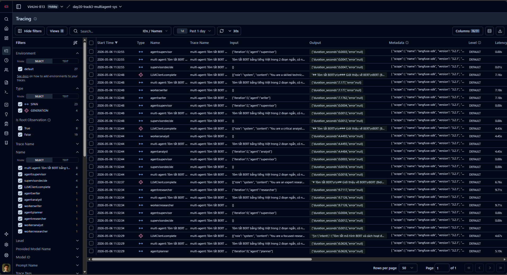
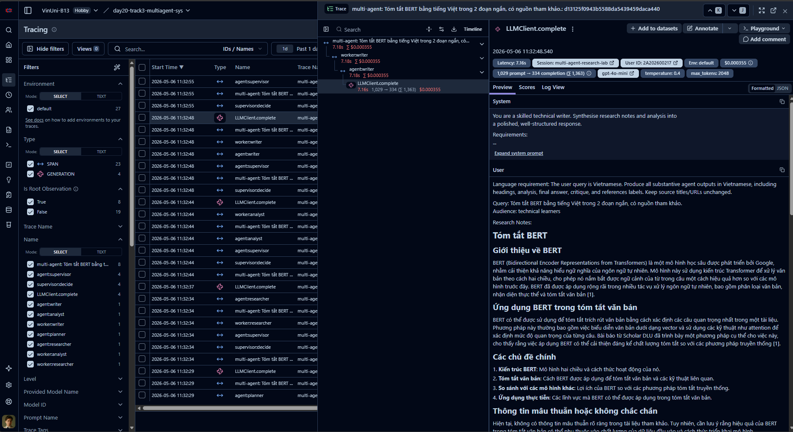

# Minh Chứng Trace — Multi-Agent Workflow

> **Sinh viên:** 2A202600217 — Nguyễn Tiến Đạt  
> Trace JSON/export: `reports/dashboard_latest.json`, `reports/trace.json`  
> Trace trực quan local: mở `http://127.0.0.1:5173` rồi bấm `Execution Graph`  
> Trace cloud: Langfuse project `day20-track3-multiagent-sys`, mục Tracing

## Langfuse Trace Screenshot





## Trace Thể Hiện Gì?

```text
User Prompt
  -> PlannerAgent
  -> SupervisorAgent
  -> ResearcherAgent
       -> SearchClient.search (SearXNG)
       -> LLMClient.complete (research synthesis)
  -> AnalystAgent
       -> LLMClient.complete (analysis)
  -> WriterAgent
       -> LLMClient.complete (final answer)
  -> CriticAgent
       -> LLMClient.complete (quality gate)
  -> done hoặc revision loop nếu điểm thấp
```

## Graph Realtime

Dashboard dùng endpoint `/api/run-stream` để stream snapshot graph khi workflow đang chạy. Khi mở modal `Execution Graph`, node sẽ xuất hiện dần theo tiến trình:

- node prompt
- node planner và artifact expanded queries
- node supervisor route
- node worker agent
- node tool như `SearchClient.search`, `LLMClient.complete`
- node artifact như `Search Results`, `Research Notes`, `Final Answer`, `Critique`

Khi click một node, UI mở modal chi tiết gồm input, output, mô tả quá trình và metadata.

## Verification Hiện Tại

```text
Backend health: {"status":"ok"}
Frontend: 200 OK
SearXNG: OK
Lint: ruff check src tests -> All checks passed
Typecheck: mypy src -> Success
Tests: 13 passed
Frontend build: succeeded
Langfuse smoke run: đã chạy `/api/run`, log backend không còn lỗi auth
```

## Chế Độ Lỗi Đã Xử Lý

- Lỗi LLM/network được retry.
- Search fallback nếu SearXNG không khả dụng.
- Supervisor dừng khi vượt max iterations.
- Worker error được ghi vào `ResearchState.errors`.
- Critic có thể yêu cầu Writer revision một vòng nếu quality score thấp hơn threshold.
